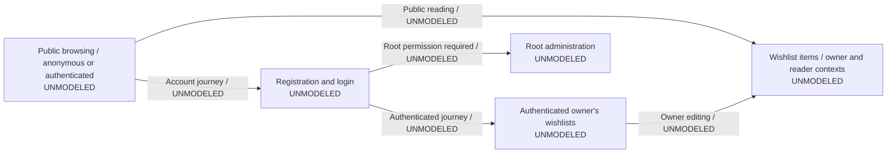

# Graph of navigation

This is the project's common graph of navigation. Every change must consult and
edit this file, following the [feature acceptance contract](agents/FEATURE_ACCEPTANCE.md).
Maintain accepted states and transitions in the shared Mermaid graph, using feature
subgraphs and stable IDs. Detailed feature records extend this graph; independent
feature diagrams cannot replace an update here.

The initial relationships below summarize the [application journeys](README.md#functionality).
They remain **UNMODELED**: an overview relationship is not an accepted transition,
an implementation claim or evidence of coverage. Add detailed navigation when
behavior changes; no full application backfill is required.

## Navigation records and feature models

No detailed product model is accepted by this documentation change. Add accepted
feature records at `docs/acceptance/features/<feature-id>.md` and link them here.
Include every modeled state and transition in the common graph above, using the
same IDs and shared-state ownership as the detailed records. The records define
the full expectations; the graph displays their navigation and realization status.

For every accepted transition, maintain an entry here with its ID, source/target
IDs, owning record link, implementation status, responsible file/symbol/revision
links or descriptive `TBD` naming missing behavior and planned location, and
separate check/evidence references and conformance status. Edge labels include the
transition ID, action/result and realization status. A code link identifies where
behavior is realized; only the specified evidence establishes conformance.
Compare this index, the shared diagram and detailed records after every change.
Retired IDs retain their supersession references.

The [wishlist creation example](agents/examples/wishlist-acceptance.md) is a proposed
plan, not an accepted model to import. Reservations, email/deeplinks and native
journeys remain unmodeled; omissions are not coverage assertions. The existing
served Chromium smoke checks provide limited regression coverage, as described
in the [browser gate guide](README.md#served-web-browser-verification).

## Change impact records

Every change updates this graph and its affected records, realization links or
evidence. If no navigation behavior changes, still edit this section with a stable
change/chapter ID, baseline, affected IDs or an explicit empty set, a concrete
reason, and plan/check/evidence references. A timestamp-only edit or an unchanged
feature diagram does not satisfy maintenance. Excluding product/UI checks does
not exclude this required update. Preserve historical reports and accepted plans.

| Change/chapter | Baseline and navigation impact | Plan/model references | Checks/evidence |
|---|---|---|---|
| FW-89 | Follow-up to `0139bb8f79502bd8572e2cba75d678720949cebf`; affected product state/transition IDs: none. Framework documentation now requires this common root graph for every change; application behavior and the unmodeled journey relationships are unchanged. | [Acceptance and maintenance policy](agents/FEATURE_ACCEPTANCE.md#model-maintenance-and-chapter-lifecycle); no new accepted product model | [Navigation and link verification report](agents/task/06.10.2026_11.18.46-d35d6394-197a-420c-8802-386c64079081/002-root.md) |
