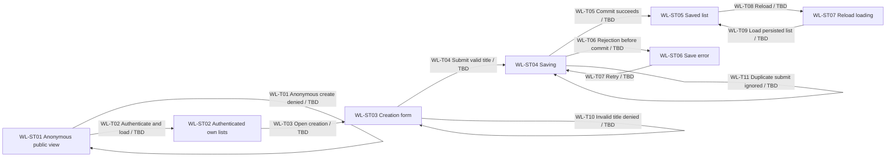

# Worked acceptance example: create a wishlist

This proposed example demonstrates the [acceptance contract](../FEATURE_ACCEPTANCE.md).
The example is not an approved product specification, a live feature execution or
a newly approved visual baseline. The denial presentation and other example
decisions below would need confirmation for a real feature plan. `TBD` identifies
required behavior/checks to implement, not an assertion that existing code is wrong.

The common [graph of navigation](../../NAVIGATION.md) is the required project-root
model. This unaccepted example stays separate; a real accepted feature would add
its states/transitions and owning-record links to that shared graph using these
same IDs, with realization links or descriptive `TBD` and separate evidence.

## Requirements, scope and decisions

- `WL-R01`: an authenticated owner submitting a valid unique title creates exactly
  one list for that owner; the title and list remain after reload.
- `WL-R02`: anonymous users cannot create lists or read protected personal list data;
  public reading remains available. The example assumes hidden creation controls
  and an authorization rejection for a crafted request; confirm that presentation.
- `WL-R03`: a save rejected before commit retains the entered title, shows an error
  and supports retry without false success or a duplicate record.
- `WL-R04`: form, loading, empty, success and error states meet the viewport,
  keyboard/focus and visual criteria below.
- `WL-INV01`: creation persists only for the authenticated owner; no other user's
  data changes. `WL-INV02`: a pre-commit rejection creates no list and emits no
  success notification. `WL-INV03`: one successful submission creates one record.

Scope is wishlist creation and its public/authenticated entry, save, reload and
retry paths. Editing/deletion, reservations and other failures (including ambiguous
post-commit timeouts) are excluded with explicit gaps. A real plan must assess those
adjacent paths and include any impacted regression. Initial visual reference and
native inspection handling decisions are unresolved here, so this example cannot
be accepted for implementation unchanged.

## States and Mermaid projection

| State ID | User-visible state and relevant context | Invariants |
|---|---|---|
| WL-ST01 | Anonymous public view; no personal data loaded | WL-INV01 |
| WL-ST02 | Authenticated owner; own lists loaded, possibly empty | WL-INV01 |
| WL-ST03 | Creation form; entered title editable | WL-INV01 |
| WL-ST04 | Saving; submission pending and disabled | WL-INV01, WL-INV03 |
| WL-ST05 | Saved list visible; success feedback | WL-INV01, WL-INV03 |
| WL-ST06 | Pre-commit save error; entered title retained, retry available | WL-INV01, WL-INV02 |
| WL-ST07 | Reload loading; persisted list lookup pending | WL-INV01 |

All transition realization statuses are `TBD` in this proposed model.

## Authoritative transition records

Every transition belongs to the proposed `wishlist-create` feature and is required
in the bounded example coverage set. Implementation status is `TBD`; all check
results start `UNVERIFIED`. The table uses normal Markdown because this example is
outside step files; a real step report carries the complete records in AML-HIP.

| ID; source → target | Trigger, actor and guard | Observable outcome; side effects; forbidden effects | Traceability | Implementation / remaining work |
|---|---|---|---|---|
| WL-T01; WL-ST01 → WL-ST01 | Anonymous creation attempt, including crafted request; no authenticated identity | Creation UI unavailable and request rejected; no list created or personal data exposed; public reading preserved | WL-R02; WL-SC02; WL-C02; WL-CK02 | `TBD`: link hidden-control logic and actual server authorization guard after inspection; implement any missing guard/denial |
| WL-T02; WL-ST01 → WL-ST02 | Successful authentication event; owner identity established | Own lists load and creation entry is visible; no other owner's data returned | WL-R01, WL-R02, WL-R04; WL-SC01; WL-C01, WL-C03, WL-C06; WL-CK01, WL-CK05 | `TBD`: link authentication/navigation and owned-list loading symbols; existing registration smoke below covers only part of the entry |
| WL-T03; WL-ST02 → WL-ST03 | Owner selects creation; own-list context ready | Editable form opens with keyboard focus; no persistent change | WL-R04; WL-SC01; WL-C03, WL-C06; WL-CK01, WL-CK05 | `TBD`: link creation view, navigation and focus realization; implement missing behavior |
| WL-T04; WL-ST03 → WL-ST04 | Owner submits nonempty title; no request in flight | Loading shown, duplicate submission disabled; one save request; no premature success | WL-R01, WL-R04; WL-SC01, WL-SC03, WL-SC04; WL-C01, WL-C03, WL-C06; WL-CK01, WL-CK03, WL-CK04, WL-CK05 | `TBD`: link submit handler, request and pending-state symbols; implement missing behavior |
| WL-T05; WL-ST04 → WL-ST05 | Successful committed save response | Exactly one correct owner/title record and visible usable list; success feedback after commit; no unrelated writes | WL-R01, WL-R04; WL-SC01, WL-SC03; WL-C01, WL-C06; WL-CK01, WL-CK04, WL-CK05 | `TBD`: link UI completion, save service and persistent creation symbols; add exact-count/ownership assertions |
| WL-T06; WL-ST04 → WL-ST06 | Controlled pre-commit rejection | Error visible, title preserved, retry enabled; zero created records and zero success feedback | WL-R03, WL-R04; WL-SC03; WL-C04, WL-C06; WL-CK04, WL-CK05 | `TBD`: link error-state and pre-commit rejection handling; implement missing error/retention behavior |
| WL-T07; WL-ST06 → WL-ST04 | Owner retries unchanged title; previous request ended | Single new attempt; pending feedback; no duplicate creation or stale success | WL-R03; WL-SC03; WL-C04; WL-CK04 | `TBD`: link retry trigger and state reset; implement missing recovery |
| WL-T08; WL-ST05 → WL-ST07 | Owner reloads browser; authenticated session retained | Loading shown; no creation replay; persistent data unchanged | WL-R01; WL-SC01; WL-C05; WL-CK01 | `TBD`: link reload/session restoration and list query; implement missing restoration |
| WL-T09; WL-ST07 → WL-ST05 | Owned-list lookup succeeds | Same saved list/title visible; exactly one record remains for the owner | WL-R01; WL-SC01; WL-C05; WL-CK01 | `TBD`: link list-load and display symbols; add persistence assertions |
| WL-T10; WL-ST03 → WL-ST03 | Owner submits empty/whitespace title | Validation feedback; form retained; zero save requests or new records | WL-R01, WL-R04; WL-SC04; WL-C01, WL-C03; WL-CK03 | `TBD`: link title-validation and feedback symbols; implement missing boundary handling |
| WL-T11; WL-ST04 → WL-ST04 | Owner attempts another submission while saving | Pending state unchanged and submission disabled; zero additional requests/records | WL-R01, WL-R04; WL-SC04; WL-C01, WL-C03; WL-CK03 | `TBD`: link pending-state duplicate guard; implement missing prevention |

The native `WL-CK06` additionally covers `WL-T01`, `WL-T02`, `WL-T04`–`WL-T09`
for the shared authorization/save/failure/reload criteria in the platform matrix;
native navigation and visual expectations need their own confirmed specifications.

For an implemented transition, replace the descriptive `TBD` with actual file and
symbol hyperlinks and the reviewed revision. Multiple links are expected where
navigation, authorization and storage are realized in different layers. Preserve
the separate test/evidence columns and status when code links are added.

One inspected, revision-pinned check reference already exists for a
**limited adjacent regression**:
[ServedWebSmokeTest at the #88 baseline](https://github.com/InsanusMokrassar/WishlistApp/blob/05e578cde70c1477a65eaa09a2aa8233f8faa6a0/browserTests/src/test/kotlin/dev/inmo/wishlist/browser/ServedWebSmokeTest.kt).
`rendersApplication` asserts meaningful mounting and zero anonymous requests to
`GET /api/wishlist/getMy`; `registersAndReachesAuthenticatedUi` waits for Log out
and New Wishlist controls after registration. The reference does not realize or
prove creation, save persistence, crafted-request denial, failure/retry or visuals.
No execution of those tests is claimed by this example.

## Scenarios and criteria

- `WL-SC01`: isolated authenticated owner with no lists opens creation, enters a
  unique valid title, submits once, waits for committed success, reloads and sees
  the same list. Verify exact count, stored owner/title, disabled duplicate
  submission, and no unrelated owner changes (`WL-T02`–`WL-T05`, `WL-T08`, `WL-T09`).
- `WL-SC02`: new anonymous browser context attempts creation and a crafted request;
  assert denied action, zero records/personal-data exposure, and preserved public
  reading. Use the confirmed presentation decision (`WL-T01`).
- `WL-SC03`: isolated owner submits a valid title while a fixture rejects the save
  before commit; assert error, preserved title, no success and zero records. Remove
  the failure and retry; assert exactly one persisted record (`WL-T04`–`WL-T07`).
- `WL-SC04`: empty/whitespace title and rapid repeated submit exercise boundaries;
  assert defined validation feedback and no extra request/record (`WL-T04`,
  `WL-T10`, `WL-T11`).

`WL-C01` covers exact successful ownership/title/count; `WL-C02` covers denial and
public-reading regression; `WL-C03` covers initial/empty/editable/pending/disabled
states, visible keyboard focus and usable submission; `WL-C04` covers error/retry,
retained input, readable error feedback and no false success; `WL-C05` covers reload
persistence and loading feedback. `WL-C06` covers visuals: at the chosen viewports,
fields/buttons fit without horizontal overflow or clipping, error text is readable,
focus is visible and tab order is logical; layout/spacing/colors agree with the
approved reference. Do not infer those properties from DOM visibility.

## Platform and method matrix

| Target | Required example criteria/checks | Rationale / remaining decision |
|---|---|---|
| Managed Chromium from Playwright 1.52.0; 1280×800 and 390×844; device scale 1 | WL-C01–WL-C06; WL-CK01–WL-CK05 | Example Web change affects submission and responsive states; pin fonts/data/time, disable animations and wait for settled network/fonts before visual capture |
| Android and Desktop | WL-C01, WL-C02, WL-C04, WL-C05; WL-CK06 | Shared creation/auth/data changes may affect native clients; automated integration plus explicitly approved native inspection required; approval/setup remain unresolved |
| Other Web browsers | Not applicable to this illustrative Chromium-only proposal | No cross-browser assurance claimed; a real plan must confirm required browser scope rather than adopt this exclusion automatically |

| Check ID | Method, location and required assertions | Setup/command and evidence contract |
|---|---|---|
| WL-CK01 | Served-browser feature test `TBD` in `browserTests/src/test/kotlin/dev/inmo/wishlist/browser/`; WL-SC01; exact persisted owner/title/count and reload/UI outcomes | Extend the isolated fixture; run `./gradlew browserTest --console=plain`; retain revision/delta, JDK/browser/viewport identity, real exit/counts, report and relevant traces |
| WL-CK02 | Server authorization integration test `TBD` plus anonymous served scenario WL-SC02; denial, no data exposure/writes, public-reading regression | Allocate a fresh throwaway fixture and name the owning server test task after source inspection; retain actual request/result/assertion evidence; don't invent an executable test name |
| WL-CK03 | Unit/integration test `TBD` for WL-SC04 and pending submission; validation and exact request/record counts | Identify actual owner module and test command in a real plan; deterministic input cases; fresh test report |
| WL-CK04 | Integration and served-browser fault/retry test `TBD`; WL-SC03; pre-commit rejection, no false success, recovery and single persisted record | Add a test-owned rejection fixture with a reset/cleanup path; run the specified owner task and `./gradlew browserTest`; retain assertions and failure/recovery artifacts |
| WL-CK05 | Approved visual comparison or operator-approved inspection; WL-C03, WL-C04, WL-C06 at both viewports | Baseline/inspection decision `TBD`; use fixed font/data/browser/time/animation conditions; no default tolerance; retain approved reference/candidate/diff or criterion-by-criterion reviewer observations |
| WL-CK06 | Native integration checks plus operator-approved Android/Desktop inspection for the affected shared criteria | Exact OS/device/runtime/commands and manual handling approval `TBD`; preserve actual observations and limitations; Web results cannot substitute |

Use unique disposable owners/titles and a fresh database/uploads directory per
served invocation, following the [existing browser setup](../../README.md#served-web-browser-verification).
Capture assertions before cleanup, stop test-owned processes and remove only
test-owned data. Pre-commit rejection is deliberate fault injection, not a mock
that silently bypasses the persistence assertion. Never use an operator database.

## Recorded outcome and chapter maintenance

Required transitions are `WL-T01`–`WL-T11`; required invariants are `WL-INV01`–`WL-INV03`;
required checks are `WL-CK01`–`WL-CK06`. Checked/failed/skipped/unavailable sets are
empty because this is a proposal; every required check/transition is unverified.
All realization records are `TBD`, and manual/baseline decisions remain unresolved.
Result is **BLOCKED**, not an accepted feature or proof of execution.

A real accepted plan would resolve those decisions, inspect/name actual symbols
and check commands, and copy the complete substantive records into its immutable
report using AML-HIP. Each existing implementation increment consults that same
accepted scope, replaces completed realization `TBD` entries, updates the Mermaid
status labels in the common root graph and matching detailed projection, and
attaches fresh evidence by ID. Every change edits `NAVIGATION.md`; changes with no
navigation impact still record the chapter/baseline, affected IDs or explicit empty set, concrete
reason and plan/check/evidence there. An independent example or feature diagram
cannot satisfy that duty. Code links alone leave conformance
unverified. A failed save/reload, missing recovery test, unjustified native skip or
self-approved visual baseline remains blocked under the
[focused contract checks](../FEATURE_ACCEPTANCE.md#focused-contract-checks).
