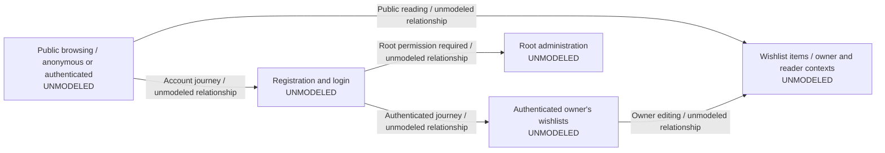

# Application interaction overview

The [feature acceptance contract](../../agents/FEATURE_ACCEPTANCE.md) defines the
authoritative record format, evidence and maintenance policy. This overview starts
incremental modeling; it is not a full application specification or a coverage
claim. The relationships below summarize journeys described in the
[application README](../../README.md#functionality). Every feature remains
**unmodeled** until an accepted detailed model is added for changed behavior.

## Feature models

Add detailed models at `features/<feature-id>.md` when a feature changes. Each file
contains authoritative state/transition records and a Mermaid projection, with
stable IDs, implementation hyperlinks or descriptive `TBD` entries, and independent
test/evidence references. Link added models here and identify cross-feature shared
states by the owning model's ID/reference. Update overview relationships when those
boundaries change; do not duplicate shared expectations.

No detailed product model is accepted by this documentation change. The
[wishlist creation example](../../agents/examples/wishlist-acceptance.md) is a
worked proposed plan, not an approved product requirement or completed feature.
Other journeys, including reservations, email/deeplinks and platform-specific
behavior, remain unmodeled; omissions are not coverage assertions.

The served Chromium smoke suite covers initial rendering and registration reaching
authenticated UI, plus focused browser-response classifier tests. It supplies
limited regression evidence, not complete feature, persistence, permissions,
visual, Android/Desktop or cross-browser coverage. Its setup, isolation, commands
and artifacts are documented in the
[browser gate guide](../../README.md#served-web-browser-verification).
